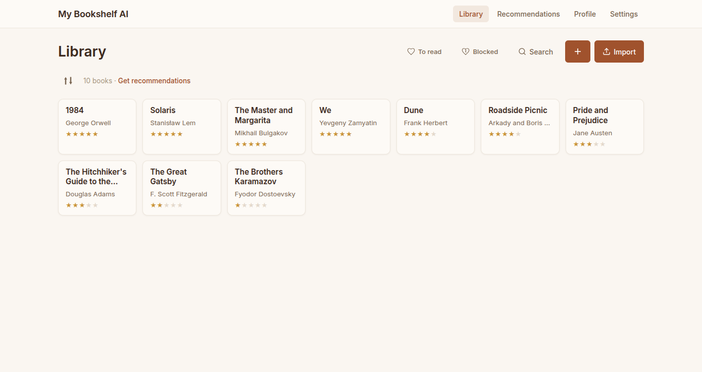
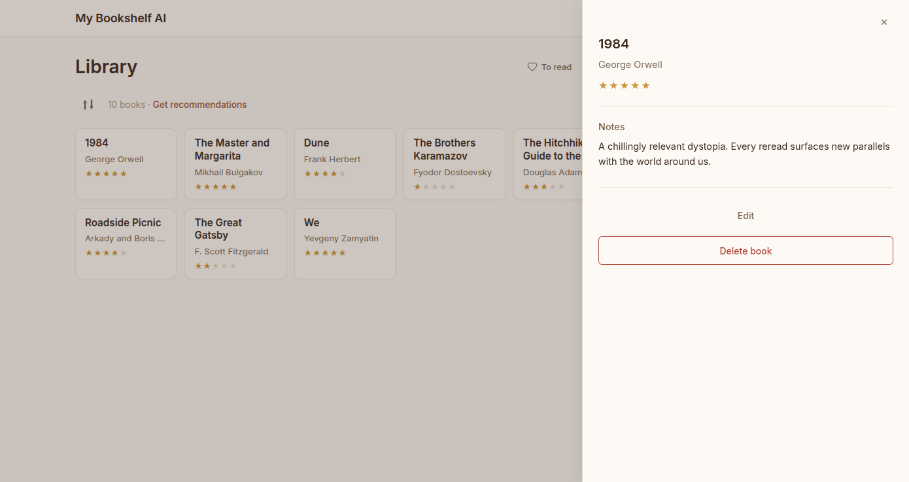
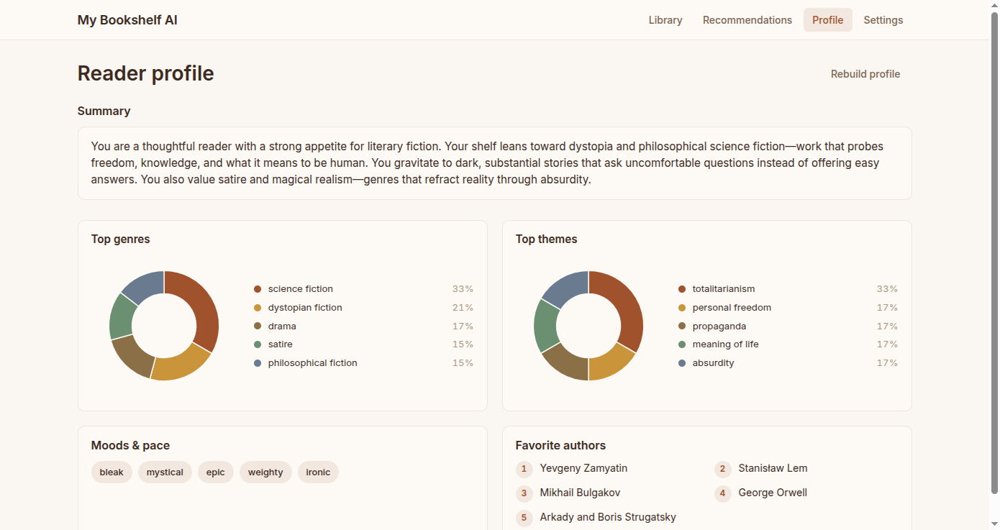
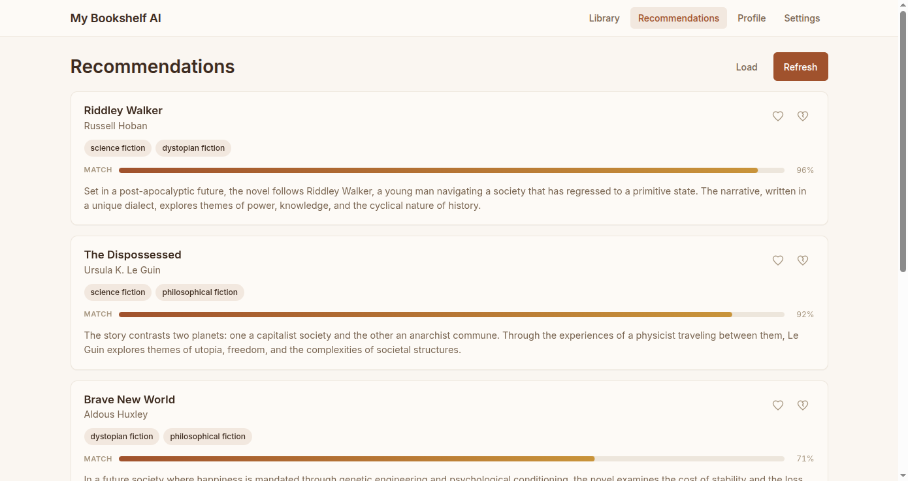
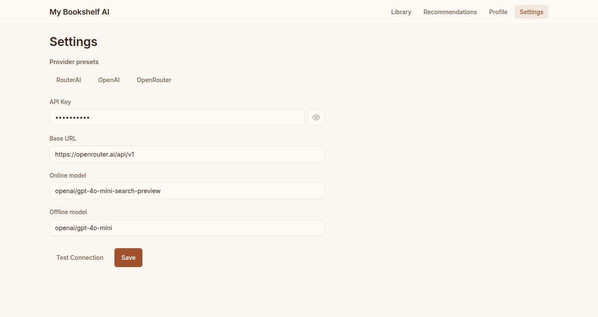

# MyBookshelfAI

[](https://github.com/GoKitiky/MyBookshelfAI/actions/workflows/ci.yml)

**AI-powered personal book recommender. Bring your own API key.**

Import your reading notes as Markdown files, get AI-powered enrichment (genres, themes, mood, complexity), a reader profile built from your library, and personalized book recommendations.

**Why this project:** keep notes and taste in one place, run everything locally (or in Docker), and plug in any OpenAI-compatible API—no vendor lock-in for how you host the app.

**Limits:** you need your own LLM API key for enrichment and recommendations; data stays on your machine (SQLite). This is not a hosted SaaS.

## Screenshots

### Library

Import and browse books from your Markdown notes.




### Book detail

Enrichment: genres, themes, mood, complexity, and summary.



### Reader profile

Taste summary built from your library.



### Recommendations

Personalized suggestions with match scores.



### Settings

API key, provider presets, and model names (BYOK).



## Features

- **BYOK** — works with RouterAI, OpenAI, OpenRouter, or any OpenAI-compatible API
- **Markdown file import** — upload `.md` book notes through the web UI
- **Book enrichment** — LLM extracts genres, themes, mood, complexity, and a plot summary for each book
- **Reader profiling** — statistical aggregation + LLM prose summary of your reading taste
- **Personalized recommendations** — ranked suggestions with match scores based on your profile
- **Bilingual UI** — Russian and English interface

## Quick Start

```bash
git clone https://github.com/GoKitiky/MyBookshelfAI.git
cd MyBookshelfAI
```

### One command (recommended)

- **Docker:** `./scripts/run.sh docker` — creates `.env` from `.env.example` if missing, then `docker compose up --build`
- **Local dev:** `./scripts/run.sh local` — installs Python/Node deps and runs `make dev`

### Docker

```bash
docker compose up --build
```

Docker Compose **v2.24+** treats `.env` as optional for the API service. Older Compose versions may error if `.env` is missing—in that case run `cp .env.example .env` or upgrade Docker Desktop / the Compose plugin.

Then open **http://localhost:5173** (Vite proxies to the API on port 8000).

**Self-hosted notes:** API `8000`, UI `5173`. With the default Compose file, the SQLite database lives in a **named volume** (`bookshelf_data`), not in `./data` on the host. Reset data with `docker compose down -v`.

### Manual

```bash
pip install -r requirements.txt
cd frontend && npm ci && cd ..
make dev
```

Or run servers separately: `uvicorn app.main:app --reload` and `cd frontend && npm run dev`.

Then open <http://localhost:5173>:

1. Go to **Settings** and enter your API key (and base URL / model names if not using OpenAI directly).
2. **Import** your `.md` book notes.
3. **Enrich** → **Build profile** → **Get recommendations**.

### Linux desktop (Tauri)

This repo also supports a Linux desktop build where the backend is started
automatically as a Tauri sidecar (no separate `uvicorn` command).

Prerequisites:

- Rust toolchain (`rustup`, `cargo`)
- Linux Tauri system dependencies (WebKitGTK, GTK3, libayatana-appindicator)
  - Ubuntu/Debian example: `sudo apt install -y libwebkit2gtk-4.1-dev libgtk-3-dev libayatana-appindicator3-dev librsvg2-dev patchelf`
- PyInstaller for the backend sidecar build (`pip install pyinstaller`)

Desktop dev/build commands:

```bash
cd frontend
npm ci
npm run desktop:dev
# or: npm run desktop:build
```

Equivalent Make targets from repo root:

```bash
make desktop-dev
# or: make desktop-build
```

Desktop runtime data is stored in the app data directory resolved by Tauri.
You can override it with `MYBOOKSHELFAI_DATA_DIR` when needed.

## Markdown File Format

Each book is one `.md` file. Title and author are extracted from the filename:

```
Title «Author».md
Title - Author.md
"Title" Author.md
```

Inside the file you can optionally include:

- **YAML front matter** with `tags`:

  ```yaml
  ---
  tags: [fiction, sci-fi]
  ---
  ```

- **Rating** anywhere in the body text — recognized patterns include:
  - `rating: 4/5`, `4 из 5`, `оценка 4`
  - `8/10` (converted to 5-point scale)
  - Star characters: `★★★★☆`, `⭐⭐⭐`

The rest of the body text is treated as your reading notes / review.

## Configuration

The **Settings page** in the web UI is the primary and recommended way to configure API keys and models. Values are saved in a local SQLite database. Provider presets (RouterAI, OpenAI, OpenRouter) let you quickly fill in the base URL.


### First-run migration

On startup, **`seed_from_env()`** runs once per empty setting: if the settings database has no value for a key yet, it copies the corresponding value from environment variables (for example from a `.env` file loaded into the process). After values exist in the database, you normally manage them in the UI.

### How settings are read at runtime

- **API key:** The LLM client uses the key stored in SQLite (after any initial seed from the environment). It is not read on every request directly from `os.environ`.
- **Base URL and models:** If a value is missing in the database, the app can **fall back** to defaults from environment variables—see [`config.py`](config.py) and [`app/services/llm.py`](app/services/llm.py).

### Environment variables

See [`.env.example`](.env.example) for variables you can set for Docker, headless setups, or first-run seeding.

## Tech Stack

- **Backend** — Python, FastAPI, SQLite
- **Frontend** — React, TypeScript, Vite
- **LLM** — OpenAI SDK (compatible with any OpenAI-compatible endpoint)

## Testing

```bash
pytest
```

Unit tests (model parsing, profile aggregation) run without an API key. Integration tests that call the LLM are automatically skipped when `LLM_API_KEY` is not set.

## Contributing

See [CONTRIBUTING.md](CONTRIBUTING.md). Please follow [CODE_OF_CONDUCT.md](CODE_OF_CONDUCT.md).

## Security

Report vulnerabilities as described in [SECURITY.md](SECURITY.md).

## License

This project is licensed under the MIT License — see [LICENSE](LICENSE).
